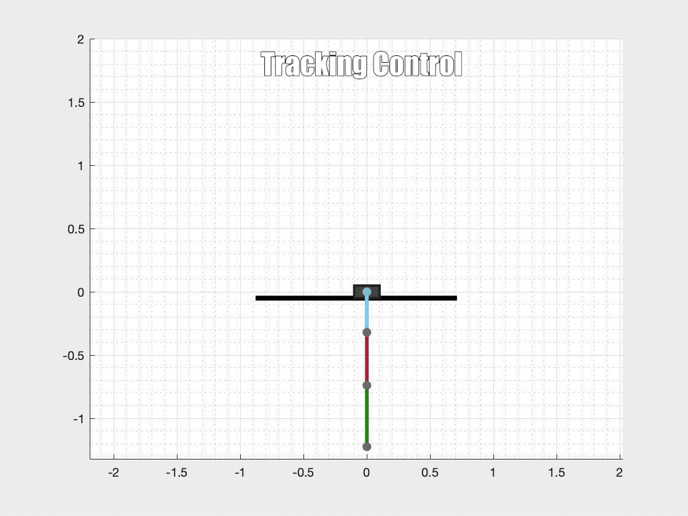
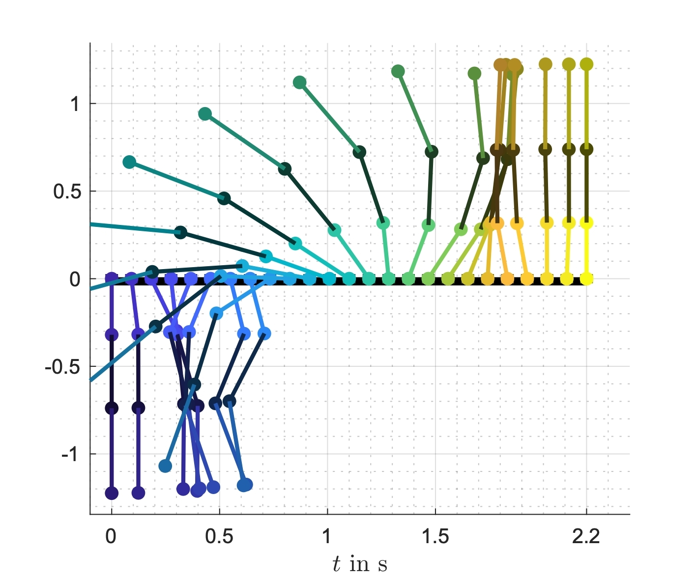
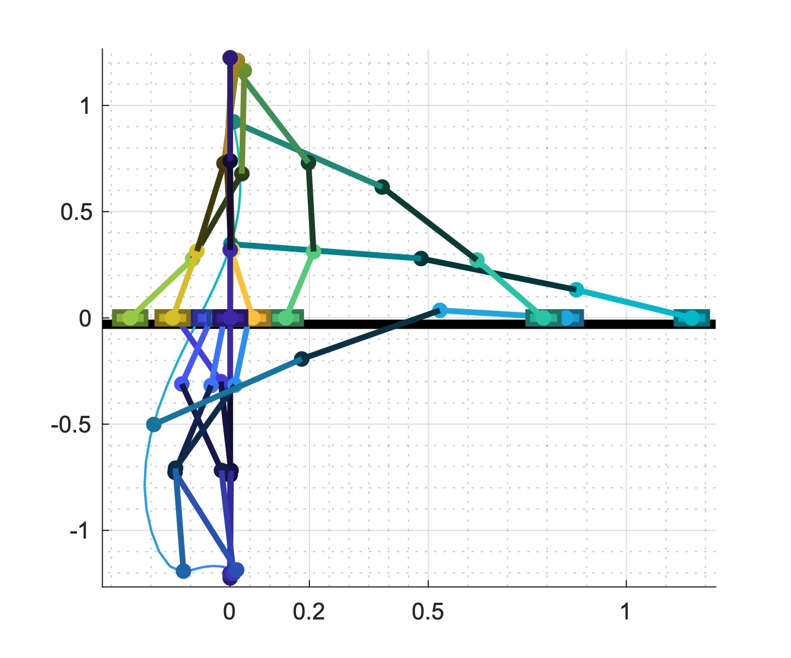
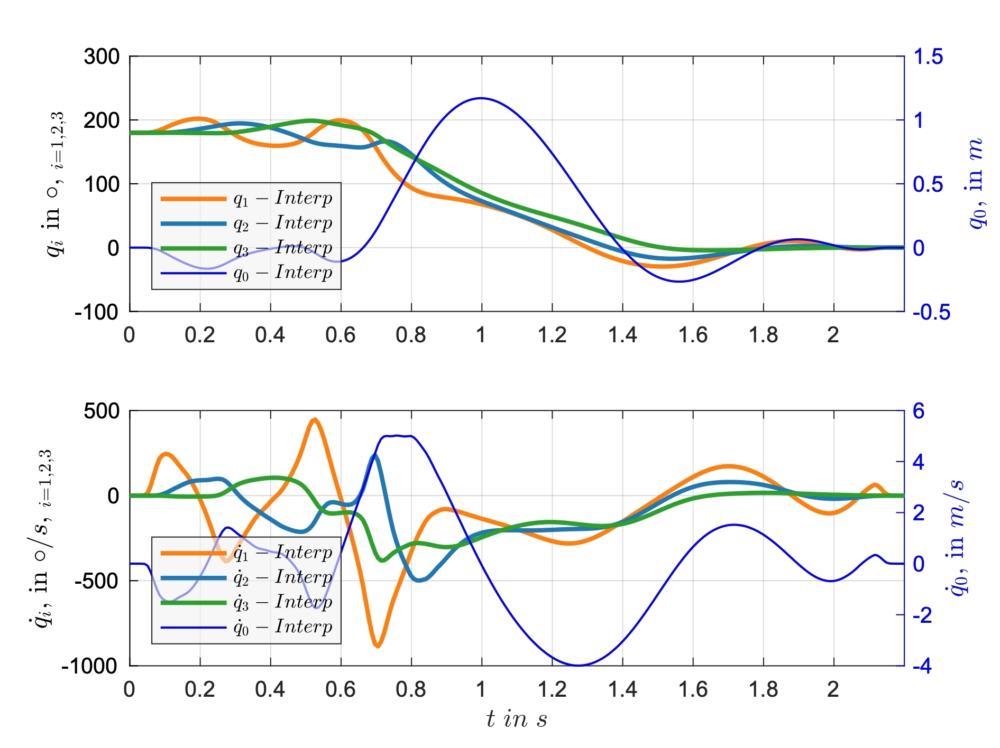
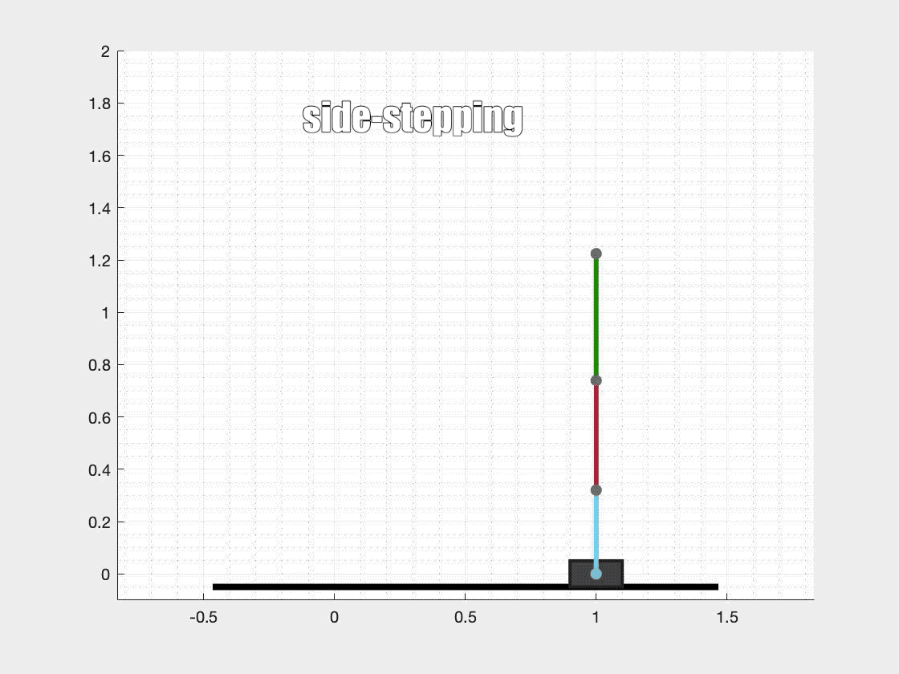

# Inverted triple pendulum

Trajectory planning and Tracking control of the inverted triple pendulum.

Swing-up:

Side-Stepping:

## Installation
Just clone the repository and read Documention.
If you want to create new Trajectories with matlab you have to install [OptimTraj](https://github.com/MatthewPeterKelly/OptimTraj) in matlab folder.

## Usage

Please read the Documentaion file.

## License
[MIT](https://choosealicense.com/licenses/mit/)
